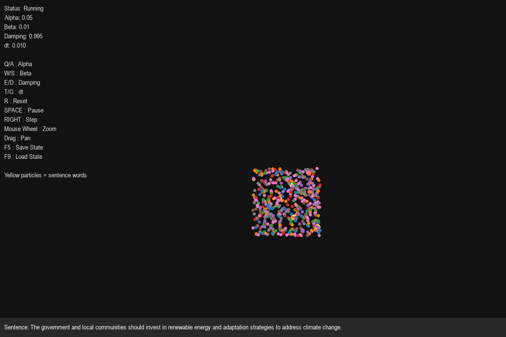
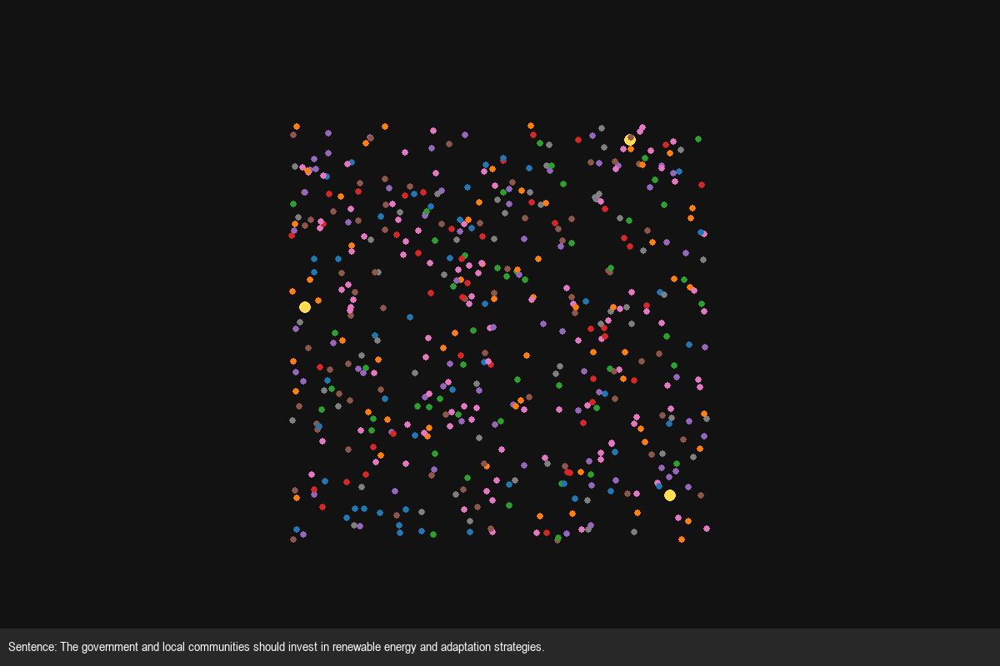
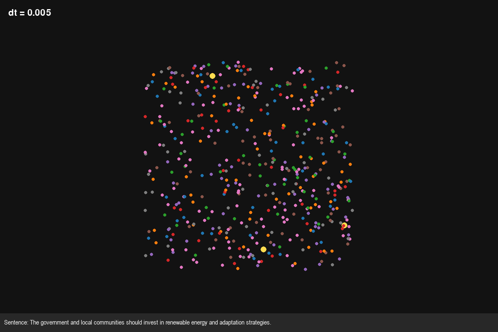

# Semantic Turing Field (STF)

The Semantic Turing Field (STF) is an experimental visualization that
treats words as interacting particles in a dynamic physical system.

STF explores whether semantic relationships can be represented as an evolving
dynamical system rather than only as static geometry in an embedding space.

The project uses pretrained GloVe word embeddings as its semantic
foundation:

> Jeffrey Pennington, Richard Socher, Christopher D. Manning.  
> "GloVe: Global Vectors for Word Representation." EMNLP 2014.

Words are represented as particles in a two-dimensional simulation space.
Their interactions are determined by semantic similarity, producing attractive
and repulsive forces that cause the field to evolve over time.

Sentences can then be introduced as external semantic disturbances. A sentence
is converted into an embedding and used to create a temporary gravity wave
that attracts semantically related particles toward the center of the field.

### Live Demo

Explore the interactive browser version through the Streamlit application.

The web application loads precomputed semantic fields from a Hugging Face
Dataset and performs the particle simulation dynamically in the browser
environment.

## Examples

### Semantic Field



### Sentence Perturbation



### Simulation Dynamics



## Features

- Physics-inspired two-dimensional semantic simulation
- GloVe-based semantic relationships
- Attraction and repulsion driven by cosine similarity
- K-Means clustering for visual semantic grouping
- Interactive sentence perturbations
- Temporary semantic gravity-wave dynamics
- Pygame-based visualization with camera controls
- Headless simulation mode for experiments and batch execution
- Precomputed field configurations for multiple vocabulary sizes
- Hugging Face Dataset integration for web deployment
- Streamlit browser interface for interactive exploration

## Architecture

STF separates semantic processing, simulation, visualization, and deployment
into distinct components.

### High-Level Architecture

```
                     GloVe Embeddings
                            │
                            ▼
                    ┌───────────────┐
                    │  NLP Layer    │
                    │               │
                    │ Embeddings    │
                    │ Semantics     │
                    │ Preprocessing │
                    │ Clustering    │
                    └───────┬───────┘
                            │
                            ▼
                   Offline Precomputation
                            │
                            ▼
                    Precomputed Fields
                            │
                            ▼
                    Hugging Face Dataset
                            │
                            ▼
                     Streamlit Web UI
                            │
                            ▼
                  ┌────────────────────┐
                  │ STF Simulation     │
                  │                    │
                  │ Semantic Forces    │
                  │ Gravity Wave       │
                  │ Boundary Forces    │
                  └─────────┬──────────┘
                            │
                            ▼
                      Visualization
```

The expensive semantic-field construction is performed offline. The resulting
field configurations are stored in a Hugging Face Dataset and loaded by the
Streamlit application.

At runtime, sentence embeddings and gravity-wave interactions remain dynamic,
allowing users to perturb the field and observe its response.

The local Pygame application can also construct and experiment with the
simulation independently of the web application.

For the complete architecture, data flow, module responsibilities, and
execution paths, see [ARCHITECTURE.md](docs/ARCHITECTURE.md).

### Components

- `src/nlp/embeddings.py` — load and filter GloVe embeddings
- `src/nlp/semantics.py` — semantic similarity and sentence influence
- `src/nlp/text_preprocessing.py` — sentence preprocessing and embedding
  construction
- `src/nlp/clustering.py` — K-Means clustering for visual grouping
- `src/core/simulate_engine.py` — particle state and simulation dynamics
- `src/core/forces.py` — semantic attraction and repulsion
- `src/core/gravity_wave.py` — sentence-driven semantic perturbations
- `src/core/boundaries.py` — simulation boundary forces
- `src/visualization/` — Pygame renderer, camera, controls, and display
- `src/data/hf_dataset_registry.py` — Hugging Face field loading and upload
- `scripts/precompute_fields.py` — offline generation of STF field states
- `webui/app.py` — Streamlit browser application
- `docs/semantic_theory.pdf` — mathematical formulation of the STF model
- `ARCHITECTURE.md` — detailed system architecture and design

## Precomputed Fields

The web application supports five precomputed STF configurations:

| Configuration | Vocabulary |
| --- | ---: |
| 500 words | 500 |
| 1,000 words | 1,000 |
| 2,500 words | 2,500 |
| 5,000 words | 5,000 |
| Full vocabulary | Full GloVe vocabulary |

These configurations are generated offline using
`scripts/precompute_fields.py`.

The resulting artifacts include the semantic embeddings, similarity matrix,
K-Means assignments, cluster labels, and initial particle state.

They are stored in a Hugging Face Dataset repository and loaded on demand by
the Streamlit application.

This means the deployed application does not need to repeatedly download and
process the original GloVe dataset or recompute the expensive semantic field
during startup.

## Installation

Clone the repository and install the dependencies:

```bash
git clone https://github.com/karim-sharkawy/SemanticTuringField.git

cd SemanticTuringField

python -m pip install -r requirements.txt
```

For local development, create a `.env` file if authentication is required
for the Hugging Face Dataset:

```HF_TOKEN=your_huggingface_token```

The web application can consume a public Hugging Face Dataset without
requiring a token for downloads.

## Usage

### Desktop Visualization

Run the interactive Pygame application:

```bash
python run.py
```

### Custom Vocabulary Size

The local application can be run with a custom word budget:

### Run with custom word budget

```bash
python -m src.app --words 5000
```

### Headless batch mode

Run the simulation without visualization:

```bash
python run.py --no-viz --steps 5000
```

Headless execution is useful for experiments, benchmarking, reproducibility,
and generating simulation data.

### Precompute Fields

Precomputed web configurations can be generated offline with:

```python scripts/precompute_fields.py```

The resulting configurations are stored under:

```
data/precomputed/
├── 500/
├── 1000/
├── 2500/
├── 5000/
└── full/
```

These artifacts can then be uploaded to the configured Hugging Face Dataset
repository.

## Web UI

The browser version is built with Streamlit:

```bash
streamlit run webui/app.py
```

The web application loads one of five precomputed semantic fields from the
Hugging Face Dataset:

* 500 words
* 1,000 words
* 2,500 words
* 5,000 words
* Full vocabulary

Once loaded, the simulation runs dynamically and users can enter sentences
to create temporary semantic gravity-wave disturbances.

The runtime architecture is:

```
Hugging Face Dataset
        │
        ▼
Precomputed STF Field
        │
        ▼
Streamlit Application
        │
        ▼
Dynamic Particle Simulation
        │
        ▼
Sentence Gravity Wave
        │
        ▼
Visualization
```

The expensive semantic-field construction is therefore performed offline,
while interactive sentence exploration remains dynamic.

## Simulation Dynamics

STF can also be used to explore how changes in simulation parameters affect
the evolution of the field.

For example, changing the timestep produces visibly different trajectories
and rates of motion:

## Controls

### Desktop Application

| Key | Action |
| --- | --- |
| `Enter` | Begin typing a sentence |
| `Return` | Submit sentence and trigger gravity wave |
| `Space` | Pause / resume |
| `Right Arrow` | Single step while paused |
| `R` | Reset simulation |
| `Q` / `A` | Increase / decrease alpha |
| `W` / `S` | Increase / decrease beta |
| `E` / `D` | Increase / decrease damping |
| `T` / `G` | Increase / decrease timestep |
| `F5` | Save state |
| `F9` | Load state |
| `Esc` | Quit |

The Streamlit application provides a simplified browser interface with field
selection, simulation controls, and sentence input.

## Theory

STF treats each word as a particle in a semantic field.

Pairwise cosine similarity determines whether particles experience attractive
or repulsive interactions, while K-Means provides a separate coarse grouping
used for visualization.

When a sentence is entered, its embedding is compared with the vocabulary and
used to generate a temporary gravity-wave force. Semantically relevant words
are attracted toward the center of the field.

The core conceptual pipeline is:

```
Word Embeddings
      │
      ▼
Semantic Similarity
      │
      ▼
Signed Force Model
      │
      ▼
Particle Dynamics
      │
      ▼
Emergent Spatial Organization
```

STF is not intended to reproduce the geometry of the original embedding space
or replace the embedding model. It is an exploratory semantic dynamical
visualization that uses an embedding model as the source of semantic
relationships.

For the mathematical formulation of the force model, energy interpretation,
discrete-time dynamics, gravity wave, clustering, and model limitations, see
[docs/semantic_theory.pdf](docs/semantic_theory.pdf)

## Future Work

Potential extensions include:

- Multi-sentence context and phrase-level dynamics
- Alternative embedding models and transformer-based semantic representations
- Additional force components
- Spatial partitioning for larger vocabularies
- Quantitative measures of field stability and emergent structure
- Systematic experiments over simulation parameters
- Audio or microphone-driven semantic perturbations
- Web-native visualization using D3 or p5.js
- More sophisticated physical dynamics, including stochastic noise and
  additional physical constraints

  ## Documentation

STF includes documentation covering the system at multiple levels:

- [`ARCHITECTURE.md`](docs/ARCHITECTURE.md) — system architecture, repository
  structure, data flow, simulation layers, precomputation pipeline, Hugging
  Face integration, and runtime execution paths.
- [`docs/semantic_theory.pdf`](docs/semantic_theory.pdf) — mathematical
  formulation of the semantic force model, particle dynamics, gravity wave,
  K-Means clustering, energy interpretation, limitations, and future
  extensions.
- [`requirements.txt`](requirements.txt) — project dependencies.
- `src/utils/config.py` — default simulation and application parameters.
- `scripts/precompute_fields.py` — reproducible offline field generation.
- `src/data/hf_dataset_registry.py` — precomputed field storage and Hugging
  Face Dataset integration.

The documentation is intended to separate the conceptual, mathematical, and
implementation details of STF rather than placing all project information in
a single document.

## Project Structure

```
SemanticTuringField/
│
├── src/
│   ├── core/              # Simulation and force model
│   ├── nlp/               # Embeddings and semantic processing
│   ├── visualization/     # Pygame rendering and interaction
│   ├── data/              # Hugging Face data access
│   └── utils/             # Configuration and persistence
│
├── scripts/
│   └── precompute_fields.py
│
├── webui/
│   └── app.py
│
├── assets/
│   └── gifs/
│
├── docs/
│   └── semantic_theory.pdf
│
├── data/
│   └── precomputed/
│
├── ARCHITECTURE.md
├── README.md
├── requirements.txt
└── run.py
```

The local `data/precomputed/` directory contains generated artifacts used
during development and field generation. The deployed Streamlit application
loads the corresponding configurations from the Hugging Face Dataset.